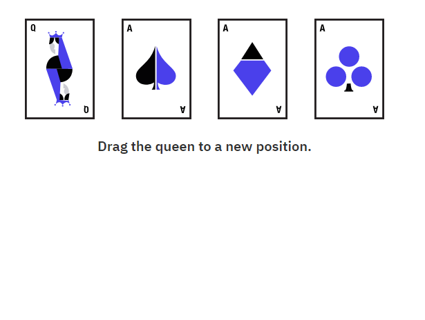
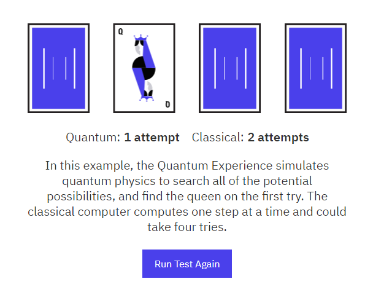

# The nail in the haystack
### What is the grover's algorithm?
This search task is to find a blue color out of $N$ cases. Each box when checked will reveal true$(1)$ or false$(0)$. In other words :  Find $x$ such that $f(x)= k$ , in this case, $x$ can represent all possibilites (this is called a superposition), where $k = 0,1$. 

This could solve problems like trying to find the best move in a chess game or the best route between two cities with $n$ transits. 

|    🔴   |  🔴     |      🔴|     🔵  |  $\cdots$  |     🔴|  
|----------|:-------:|:------:|:------:|:------:|:------:|
|  $1$     |   $2$   |  $3$   | $w$   |    $\cdots$|   $N=2^n$ |

As Lov Grover would say, the search helps you find a needle in the haystack : 
 

 For example, imagine a phone directory containing N names arranged in completely random order. To find someone’s phone number with a probability of 50%, any classical algorithm will need to access the database a minimum of 0.5N times.

Mathematically, it can be described as: 

> *Grover's algorithm is a quantum algorithm for searching an unsorted database with N entries in $O(N^{1/2)}$ time and using $O(\log N)$ storage space (see big O notation). It was invented by Lov Grover in 1996.*

Play quantum card [test](http://research.ibm.com/ibm-q/quantum-card-test/),  to see the demonstration of this on IBM's quantum experience: 

This presents a 2 qubit example of Grover’s Search algorithm. 

 

### 
 Could Grover’s quantum algorithm help in searching an actual database?

This question is not aimed at the internet search but perhaps a quantum internet. Everything available on the internet can’t
be searched with Grover’s algorithm as the internet is
not quantum. Also this question is refering to unordered databases.

Christof asked this question in 1999, in  2009  Google [started](https://ai.googleblog.com/2009/12/machine-learning-with-quantum-algorithms.html) looking at this phenomenon : 

Let’s take unstructured search as an example. Assume I hide a ball in a cabinet with a million drawers. How many drawers do you have to open to find the ball? Sometimes you may get lucky and find the ball in the first few drawers but at other times you have to inspect almost all of them. So on average it will take you 500,000 peeks to find the ball. Now a quantum computer can perform such a search looking only into 1000 drawers. This mind boggling feat is known as Grover’s algorithm.

Even before you search, Google organizes information about webpages in our Search index. The index is like a library, except it contains more info than in all the world’s libraries put together.

### 
 Arguments and Comparison 

Proponents of classical search algorithm would say this approach requires expensive quantum hardware since all the addressing system would have to work in superposition. We cannot 

**Classical**: We would need to check $\frac{N}{2}=2^{n-1}$ of the boxes on average, in order to find the present.

**Quantum** : we can find the marked item in roughly $\sqrt{N}$ steps with Grover’s amplitude amplification trick. A quadratic speedup is indeed a substantial time-saver for finding marked items in long lists. 

> First, we need to be able to implement the unitary. A common way to encode such a list set $f(w)=1$ for the winner and $f(x)=0$ for all unmarked items $x$. To use a quantum computer for this problem, we must provide the items in superposition to this function, so we encode the function into a unitary matrix called an **oracle**. First we choose a binary encoding of the items $x$, $w\in \left\{0,1\right\}^n$ so that $N=2^n$; now we can represent it in terms of qubits on a quantum computer.Then we define the oracle matrix Uf to act on any of the simple, standard basis states $|x⟩$ by $U_f\left| x \right\rangle=(-1)^{f(x)}\left|x\right\rangle \implies U_f\left| w \right\rangle=-\left| w \right\rangle$ 
 
> Any guess of its location is as good as any other, which can be expressed in terms of a quantum state called a uniform superposition:The superposition doesn't give us any information about the general state of the system. 

Initial State : $\left| s \right\rangle = H^{\otimes n}\left|0\right\rangle^n = \frac{1}{\sqrt{N} }\Sigma_{x=0}^{N-1}\left|x \right\rangle$ , since $| w⟩$ is one of the basis vectors, the overlap is $\left\langle w| s \right\rangle = \dfrac{1}{\sqrt{N}}$

## Quantum Internet

In the Netherlands,TUDelft is working on a quantum internet between four hubs: Delft, Amsterdam, Leiden en The Hague.

 <iframe width="480" height="260" src="https://www.youtube.com/embed/XzPi29O6DAc" frameborder="0" allow="accelerometer; autoplay; encrypted-media; gyroscope; picture-in-picture" allowfullscreen></iframe>

The steps of Grover's algorithm are as follows:

 
This is how Google would work if it was applying a search upon one of your queries. Results would be all fetched at once

Entanglement

Further Notes:  
[Quantum Zoo](https://quantumalgorithmzoo.org/)

[Google](https://blog.google/products/google-cloud/most-calculated-digits-pi/)

[IBM Quantum Experience](https://quantumexperience.ng.bluemix.net/proxy/tutorial/full-user-guide/004-Quantum_Algorithms/070-Grover's_Algorithm.html)