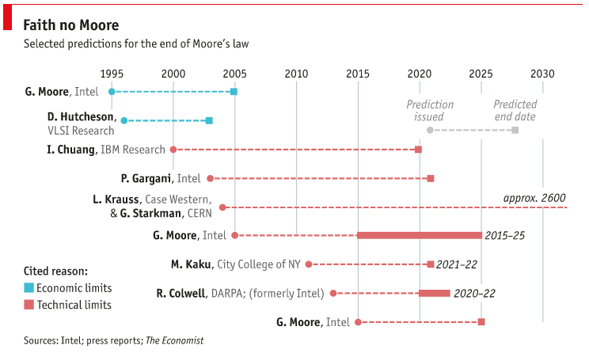
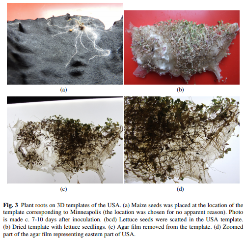
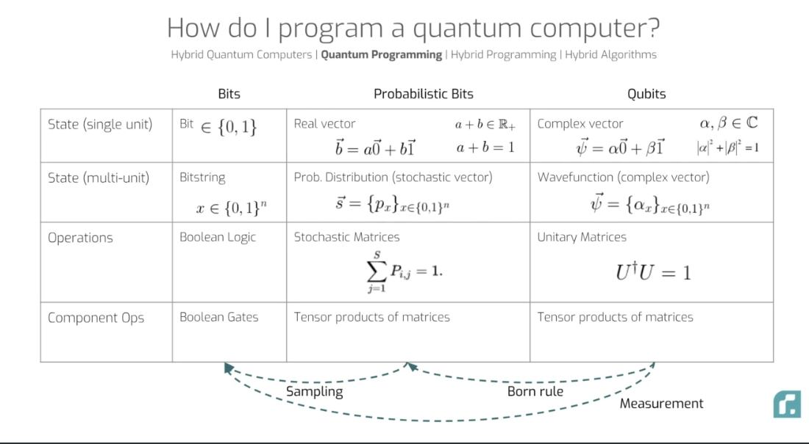
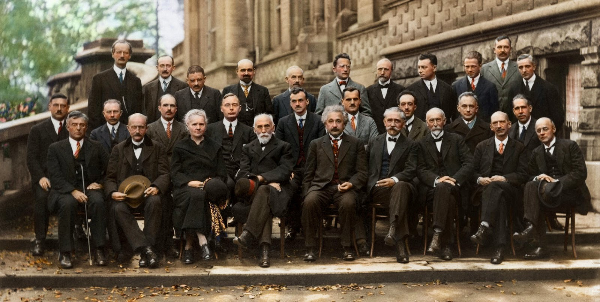
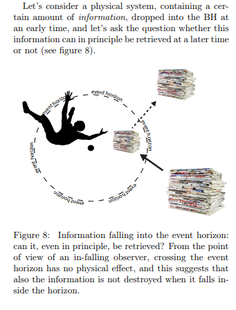

## Conventional Computing
A **conventional** computer is a system that is able to flip bits (algorithmic manipulation of binary digits) and can do finite universal computation. This computer also has many degrees of freedom, since it has billions of electrons for registering 1 bit of information, which is redundant. For example a quantum computer uses one quantum degree of freedom for each bit. But if nature is a computer, evolution proves that it takes time program it.

### 
What are the ultimate physical limits to computation?

The limits of conventional computers is that , they cannot solve intractable problems like NP-complete problems and they perform reversible computation, we will look at this later. In this article we decay away from phenomenal experience like *qualia* and semantics like *consciousness* in explaining terms. 

Seth Loydd's in his 1999 paper proposed a model of the [ultimate laptop](https://arxiv.org/pdf/quant-ph/9908043.pdf) .

The ultimate limit of speed is **energy**, any computer can perform not more than: 

> $\sum_l \frac{1}{\Delta t_l} \le \sum_l \frac{2E_l}{\pi ℏ}=  \frac{E_l}{\pi ℏ} $

operations per second (*an inverse of the Heisenberg limit*). That is, the rate at which a computer computes is limited to its energy. The actual limit is not only **Moore's Law** but the uncertainty principle in terms of the time scale.  

 

### 
The Universe is a computer
 |  Seth Lloyd

The purpose of the article was to determine just what limits the laws of physics place on the power of computers.

 Every physical system registers information, and just by evolving in time and processes that information. It is natural to think of the universe as in terms of how it processes information.. 

 Seth Lloyd wrote a book ["Programming The Universe"](https://www.nytimes.com/2006/04/02/books/chapters/programming-the-universe.html) in which he showed that you could rate the information processing power of physical systems. Here we have the world of atoms and bits seemingly unite for a collaborative narrative of naive computation.

### Post-Moore's Law Computing 

Moore's Law is the observation that the number of transistors in a dense integrated circuit doubles about every two years. $\small P_n = P_0\times 2^n$
where $\small P_k$ is the computer processing power in $\small k$ years .
If you project Moore's law into the future, you find that the size of the wires and logic gates from which computers are constructed should reach the atomic scale in about forty years; thus, if Moore's law is to be sustained, we must learn to build computers that operate at the quantum scale.

 Although it's not a law of nature; it's just an observation about technological progress from IBM's Gordon Moore. Moore admitted that his law “can’t continue forever. It is the nature of exponential functions, they eventually hit the wall". Quantum computers don't depend on this law, however assembling atoms and preparing the qubits is an incredibly hard task mesoscopically. So we can say Moore's Law 2.0 is based on entropy. 

## Unconventional Computing

Unconventional Computing is the science of challening computational limits, these modules are usually unorthodox and deliberately contrarian in nature. As a proponent of [compositionality](http://www.compositionality-journal.org/), I hesitate to crystalise this idea until I arrive to its category theoretic simplification. Great fathers of computing like Alan, Turing, Von Neumann heralded the current computer architecture. 

 <i>a computing scheme that today is viewed as unconventional
may well be so because its time hasn’t come yet - or is already
gone </i>  | <b>Tomasso Toffoli </b>  

### Peter Shor

The algorithm is significant because it implies that public key cryptography might be easily broken, given a sufficiently large quantum computer. RSA, for example, uses a public key N which is the product of two large prime numbers. Shor’s algorithm exploits interference to measure periodicity of arithmetic objects.
<iframe width="70%" height="auto" src="https://www.youtube.com/embed/lvTqbM5Dq4Q?rel=0&amp;controls=1&amp&amp;showinfo=0&amp;modestbranding=0" frameborder="0" allow="accelerometer; autoplay; encrypted-media; gyroscope; picture-in-picture" allowfullscreen></iframe>

 

# 1. Biological Computing

There are a lot of hard problems in the world that computers cannot solve, but that biology can. For many of these problems, the highest-potential path to fixing them lies in the overlap of computers and biology: computational biology.

Recently an [amoeba found an approximate solutions](https://phys.org/news/2018-12-amoeba-approximate-solutions-np-hard-problem.html.)  to NP-hard problem in linear time. Masashi Aono at Keio University assigned an amoeba to solve a Travelling Salesman Problem. Here they used a **Plasmodium**, this bio-organism has demonstrated an effecient way of solving this problem. It is not hard to see that this plant is a quantum system, but perfoming as an analogue computer. However, this used neural networks, so it farely falls under Neuromorphic computing, computing approaches based on specialized hardware that
formally adheres to one or more neural network models.

There is another side of this problem that is a decision problem, **Entscheidungsproblem**: 

> Given a length $\small L$, the task is to decide whether the graph has any tour $\small L_2< L$ , belongs to the class of NP-complete problems.

#### Synthetic cells are computers 

The models both have a input/output model, computers input bits and outputs information , 
cells process matter, the take in organic components and gives out some other compound , for example protein synthesis goes like DNA $\to$ RNA $\to$ Protein. Behind the scenes these biological processes are complex and sometimes operate as [electrical potentials](https://www.youtube.com/watch?v=fB6WuX_iNsg) , at a high-level - programming languages act in the similar way, you can run a program with Python without knowing what bits are flipped. Both are also able to form extendable and scalable suborganisms.

#### Synthetic cells are not computers

A computer operates discretely, a cell operates with a wavefunction of its state. The plants are efficient green computers. Outside in nature, the plants are programmed and hardwired to perform a narrow range of tasks aimed to maximize the plants’ ecological distribution, survival and reproduction. 

#### Morphological Computation

 Alexandry et al noted that in a morphological plant processors, data are represented by initial configuration of roots and configurations of sources of attractants and repellents; results of computation are represented by topology of the roots network. Computation is implemented by the roots following gradients of attractants and repellents.
 They continuously make distributed processing of sensory information, concurrent decision making and parallel actuation. 

 Below is a showcase of morph computers attempting to find the shortest path, similar to TSP. Here <b>shortest path</b> which states given
a space with obstacles, source and destination points, the problem is to calculate
a collision-free path from the source to the destination which is the shortest possible relative to a predefined distance metric, this is usually solved with Knuth algorithm.   | <b> UWE, Bristol</b>  

 To a computer, “A = 1” means, “A is represented in my onboard memory as a 1 or a 0. The last I heard, A was set to 1. Nothing since has happened. Therefore, A is still 1.” To a cell, “A = 1” means something very different. It means something more along the lines of: “A represented inside the cell by the concentration of some biological molecule. The equilibrium inside the cell is such that A equals 1 right now.” | <b>Social Capital</b> 

#### Biomimicry and QuBE

Biological sensors, unlike most synthetic sensors, are small, robust, operate at room temperature, and do not require clean rooms for fabrication or extremely low temperatures. Quantum Coherence is an ideal property of waves that enables stationary (i.e. temporally and spatially constant) interference. 

>  The coherent state is:  $|\alpha \rangle = e^{-\alpha ^2/2} \sum _n \frac {\alpha ^n}{\sqrt {n!}} |n \rangle $ where $|n⟩$ is a Fock state of $n$ identical particles

Biological sensor systems like photosynthesis,magnetoreception, and olfaction exude quantum effects. This is where **QuBE** comes in, which stands for *quantum effects in biological environments* . There is sound evidence for quantum coherence in photosynthesis & quantum tunneling in enzyme [action](https://arxiv.org/pdf/0805.2741.pdf)

The bold statement made here is that in a few decades we will be able to work with biology in ways that increasingly resemble the way we work with software instead of code. Digital machines generally beat cells for information processing jobs that demand precision and efficiency. But for jobs that require redundancy, adaptability and resilience in the face of the unknown? Living systems seemingly win, in other words  evolution is much more resilient than heuritics.

#### Cellular Automata

A **cellular automata** aself-reproducing models, they were designed in order to answer the question
**is it possible to construct robots that can construct identical robots**, robots of the same complexity. An automaton is a discrete dynamical system that consists of a regular network of finite state automata (cells) that change their states depending on the states of their neighbors, according to a local update rule. Most nature processes are governed by this nature, concepts like reversibility and conservation are subjects of automata. An automaton can be extended to solve massively parallel computation.

The local transition function  $\small f : S^N \to S$ calculates the value of a single future cell ${\displaystyle c_{x}}$ from the neighborhood of the observed cell in the present where $\small c_x^{t+1}=f(n_x^t)$ .

The development of cellular automata systems is typically attributed to Stanisław Ulam and John von Neumann, who were both researchers at the Los Alamos National Laboratory in New Mexico in the 1940s. Ulam was studying the growth of crystals and von Neumann was imagining a world of self-replicating robots

#### Game Of Life

Life was invented by the mathematician John Conway in 1970. The rules of the game are simple, and describe the evolution of the
grid:
> **Birth** a cell that is dead at *t* will be alive at *t+1*, if its 8 neighbours were alive at *t*.
> **Death** comes when there is overcrowding *(if a cell has atleast 4 neighbours are alive at its birth)*. Also **exposure** kills the cell, this happens when a live cell has less than 1 neighbour.

> **Survival** occurs if and only if 2 or 3 of its neighbours are alive at *t*

<iframe height="395" style="width: 100%; margin: 10px" scrolling="no" title="Game of Life on Canvas" src="//codepen.io/wottpal/embed/preview/mqwru/?height=395&theme-id=dark&default-tab=result" frameborder="no" allowtransparency="true" allowfullscreen="true">
  See the Pen <a href='https://codepen.io/wottpal/pen/mqwru/'>Game of Life on Canvas</a> by Dennis Kerzig
  (<a href='https://codepen.io/wottpal'>@wottpal</a>) on <a href='https://codepen.io'>CodePen</a>.
</iframe>

 
 

#  2. Reversible Computing 

An important insight made in 1973 by IBM colleague Charles Bennett is that any classical computation can be transformed into a reversible form.
A **reversible computing** is  a model where computation to some extend is reversible in time. 

**physical reversibility**

A process is said to be physically reversible if it results in no increase in physical entropy; it is isentropic. There is a style of circuit design and instruction set instructs building a **quantum adiabatic computer**. Adiabatic quantum computers are inherently analog devices: each qubit is driven by how strongly it is coupled to every other qubit. Einstein described this as Adiabatenhypothesis: 

 <i> “If a system be affected in a reversible adiabatic way, allowed motions are transformed into allowed motions” </i>  | <b>Albert Einstein </b>  

**logical reversibility**

A reversible logic gate can be defined as an *m*-input *n*-output logic gate is an element that realizes a logical function $\small f: \left\{ 0,1\right\}^m \to \left\{ 0,1\right\}^n$ where if *f* is injective and can be computed without erasing data. 

## Landauer's Principle
A great motivation of reversible computing is Landauer's principle. It asserts that there is a minimum possible amount of energy required to erase one bit of information, known as the Landauer limit : $\small kT\ln 2$, where $\small k = k_B$ is Boltzmann's constant, with energy dissipation $\small \Delta E\le kT\ln 2$ and $\small T$ is the temperature. A reversible computation avoids information loss by over-riding this limit on the energy efficiency of computing.

#### Information Is Physical And Computers Forget

This is a question asked by Scott Aaronson at [Shtetl-Optimized](https://www.scottaaronson.com/blog/?p=3327). Jacob Bekenstein discovered that information takes up a minimum amount of space *(holography)*, a bounded physical system can store at most $\small \frac{A}{4 \ln 2}$ bits of information, where *A* is the area in Planck units, about $\small 10^{69}$ bits per square meter. So the more information you have about a system, the more work you can extract from it. This gives an idea that there is a correlation between information and energy. Information loss from a computation implies energy dissipation due to [Landauer’s Principle](https://arxiv.org/pdf/1006.1420.pdf). 

Computers are heat engines that take energy, *E*, and work out, *W*, the solution to a problem. In the 1940's , Physicists asked why computers use so much energy? 

 
I find this idea particularly disturbing. Generally speaking a volume should tell us how much information it could hold, and its weird that the surface area tells us more information. This makes sense when you consider that when you try to pack information too densely into a given volume, it collapses to form a black hole.

Irreversibility places a lower limit on energy consumption.  $\small Q \ge \ln 2 k_BT $. To some extend, when you give a machine a good proglem, it's no longer a problem but an input to its generic instruction set. For example , a matrix computes according to the linear operation provided to it. Part of lithography is assenbling such machines.

# 3. Quantum Computing
 
 All computing systems rely on a fundamental ability to store and manipulate information. Current computers manipulate individual bits, which store information as binary 0 and 1 states. Quantum computers leverage quantum mechanical phenomena to manipulate information. To do this, they rely on quantum bits, or qubits. 

#### Qubits
We can be described as the state $\left| \psi \right\rangle$ of a qubit in general by

$\left| \psi \right\rangle = \alpha \left| 0 \right\rangle + \beta \left| 1 \right\rangle = \begin{pmatrix} \alpha \\ \beta \end{pmatrix} \:.$

The parameters $\alpha$ and $\beta$ are amplitudes, with conjugate

> $\alpha^2+\beta^2=1$.

In other words a quantum computer in particular is just a computer that tries to use rules of probability differently, namely as an amplitude. Probability is between 1 and 0, but amplitudes can be both positive and negetive, meaning it admits **superposition**. 

Let $$A$$ and $$B$$ be mutually exclusive events, then : 

classicaly:  $$p_{A \cup B}= p_A+p_B$$

quantum-ly:  $$p_{A \cup B} = |\psi_A + \psi_B|^2 = p_A + p_B + (\psi_A^* \psi_B + \psi_A \psi_B^*)$$

### The Birth of Quantum Computing
#### Solvay: 1927 
 October 1927 Fifth Solvay International Conference on Electrons and Photons, where the world’s most notable physicists met to discuss the newly formulated quantum theory
 
 

#### Feynman: 1982
Richard P. Feynman famously [asked](https://people.eecs.berkeley.edu/~christos/classics/Feynman.pdf): 

>What kind of computer are we going to use to simulate physics? 
> I would like to have the elements of this computer locally interconnected, and therefore sort of think about cellular automata as an example 

And continues with the brilliant observation 
>But the full description of quantum mechanics for a large system with $\small R$ particles is given by a function $\small ψ(x_1,x_2,...x_R,t)$ which we call the amplitude to find the particles $\small x_1,x_2...x_R$ and therefore, because it has too many variables, it cannot be simulated with a normal computer with a number of elements proportional to $\small R$ or proportional to $\small N$.”

The resources for such simulation is exponential something like $\small N^N$ configurations to be described for a computer of order $\small N $. Quantum computing power* scales exponentially with qubits $\small N$ bits can exactly simulate $\log N$ qubits

# 4. Spatial Computing
#### What is space?
We know what is computing thus far, but what is space? We could argue that we need a space-time computing interface, which is not just newtownian but affords hyperphysical interactions. Spatial computing is human interaction with a machine in which the machine retains and manipulates referents to real objects and spaces. 

#### Hyperspace

Jaron Lanier noted in the 1980's that the **homunculus** (*an approximate mapping of the human body in the cortex*) has to assimilate flexibility in order to adapt as technology improves. Perhaps Moore's Law for Physiology:  as experiences increase their weirdness over time exponentially , humans have to develop phantom limbs. The human condition has for decades described itself with 3D interactions with the physical world. The larger space of possible physical dynamics, of which the physics of our universe is but a subset, is nonlocal and thus requires revision, according to Gray Crawford. 
 
 
 “there is no reason why the objects displayed by a computer have to follow the ordinary rules of physical reality with which we are familiar” | <b>Sutherland, 1965 </b>  

 
 “adaptation does not exist if the new reality has imposed motor or mental attitudes contrary to those which were adopted on contact with other earlier given data: adaptation only exists if there is coherence, hence assimilation.”| <b> Piaget (1952) </b>  

 

#### Spatial Anchors
Microsoft has announced their Azure Cloud Anchors that allows interaction with models that are sent to cloud, synchronously. Also available on Sceneform, Cloud Anchors are ways of placing objects intaractable in virtual spaces with reference to the world. Anchoring in this case means the ability to have persistance after being superimposed in the real world.

#### AR cloud
The **AR cloud** as a subclass of spatial computing, its a theoretical map that collects digital information with adjunct to the physical world for use in AR and VR, the consistent data type thus far is **point clouds**. However the more interesting area would be when the world becomes embedded with a Visual Positioning System (VPS).

#### Light Fields

The light field is a vector function that describes the amount of light flowing in every direction through every point in space. In computational optics, light fields were first introduced by Michael Faraday in his lecture *Thoughts on Ray Vibrations*, he posed that light should be interpreted as a field, later harnessed by Mark Levoy and Pat Hanrahan. 

 <i> The aether is assumed as pervading all bodies as well as space: in the view now set forth, it is the forces of the atomic centres which pervade (and make) all bodies, and also penetrate all space</i>  | <b> M. Faraday </b>  

The 4D light field is defined as radiance along rays in empty space with plenoptic functions as $\small L(x,y,z,\alpha, \phi )$, basically all the light in 5D. Researchers have used them to fly around scenes without creating 3D models of them, to relight these scenes without knowing their surface properties, to refocus photographs after they’ve been captured,  and to build 3D models of scenes from multiple images of them. 

<iframe src="https://giphy.com/embed/l1yKd8MIEoF26lC0AS" width="80%" height="100%" style="position:absolute" frameBorder="0" class="giphy-embed" allowFullScreen></iframe>

I don't know how Leonardo figured this out in the 15th century

 <i> The air is filled with endless images(radient pyramids) of the objects distributed in it. The image of every point of the bodily surface, exists in every part of the atmosphere. All the images of the objects are in every part of the atmosphere.</i>  | <b> Leonardo Da Vinci </b>  

Light fields can enable some truly amazing VR experiences based on footage captured in the real world. This is possible because a light field records all the different rays of light coming into a volume of space. The one part that Moore's law has been lazy is the mixed-reality space, our headsets are still bulky even after 30 years, perhaps this has a step-function.

Magic Leap and Hololens support simultaneous focal plane, Avegant has designed a counterpart close to light fields but not really.  Photogrammetry has 6DOF with limits on moving objects like trees and light, Stereo Panoramas are good at realism, Light fields are good at both. Light Fields support **vergence–accommodation conflicts** , which releases eye-fatigue and improves immersion.

<iframe  style="background-color: #00000F" width="60%" height="70%" src="https://www.youtube.com/embed/lpu4GJZLXEw" frameborder="0" allow="accelerometer; autoplay; encrypted-media; gyroscope; picture-in-picture" allowfullscreen></iframe>
<iframe width="60%" height="70%" z-index="-1" src="https://www.youtube.com/embed/OUU2yGHgPQY" frameborder="0" allow="accelerometer; autoplay; encrypted-media; gyroscope; picture-in-picture" allowfullscreen></iframe>

 

# 5. Black-Hole Computing
This is important because time-reversal is not applicable to black-holes. 

This is were qc will become limited thoroughly.
Harlow-Hayden(2013) showed that to  The limits of quantum computing will be in finding collisions in a <b style="color: blue"> cryptographic hash functions</b>, this function is mapping a string to a much simpler string. So it should not be injective one-way function.  

The problem of decoding information with Hawking Radiation on the event horizon. 

No information can escape from a classical black hole: what goes in does not come out. The quantum mechanical picture of a black hole is different, however. First of all, black holes are not quite black: they radiate at the Hawking temperature.

#### [Here](https://arxiv.org/pdf/1507.00957.pdf) is a presentation of the contradiction of information in a blackhole 
Although the BH information paradox is still an open
problem

This might be an interesting way to encrypt information. 
then black holes could in principle be ‘programmed’:
one forms a black hole whose initial conditions encode the information to be processed,
lets that information be processed by the Planckian dynamics at the hole’s horizon, and
gets out the answer to the computation by examining the correlations in the Hawking
radiation emitted when the hole evaporates

# 6. Relativity Computing
Using Einsteins theory of relativity we can set a problem and time , say *T* to solve it. The computer start on the intractable problem, then take a spaceship and
accelerate to nearly the speed of light $\small (c)$. When you return to Earth, the answer to your problem will be waiting for you. 

The time-elapsed on your computer would be  $ \tiny t_{\text{computer}}= \dfrac{t}{\sqrt{1-v^2}}$. To increase this time , we would need to let $\small v \to c \implies E= mc^2$, the energy also increases with time. 

Malament and Hogarth have demonstrated that such a standard could solve the [Halting Problem]

### Relative Information 
How much information you gain when learning depends on what you believe. 

When you update your prior hypothesis $p$ to a new one $q$, how much information do you gain? This is the answer:  

$\small l(q,p)= \sum _{i=1}^nq_i\log(\frac{q_i}{p_i})$

Sometimes called the **expected surprise** or more rigorously also known as **Kullback-Leibler divergence**. 

Suppose we flip a coin which has eual probability say $\small p=q=\frac{1}{2}, l(q,p)= \log 2  $ . Here we have gained 1 bit of information. A $\small 25\%$ chance of getting a heads also means you get 2 bits. 

### Free Energy as Relative Information

The free energy of a system at temperature  $\small T$ is $\small F=\langle E \rangle- TS$ where $\small S$ is Shannon entropy and $\small \langle E \rangle$ is useful energy instead of unusable heat. Chemical reactions are driven by reducing the direction of free energy.

 #### NB: Similar remarks apply to traveling close to a black hole event horizon: if you got exponentially close then you would need exponential energy to escape. Much contents around this area are limited by considering interaction for lengths less than Plancks constant

# 7. Phenotropic Computing

This word roughly translates to **surfaces relating to each other**, **pheno**  means physical appearance ,**tropic** relating to,a turning toward, having an affinity for. Phenotropic Computing is a mechanism for component interaction that uses pattern recognition or artificial cognition in place of function invocation or message passing. Easily this could be understood as the reverse of neaural networks found in machine learning. This method is proposed to help scalable software due to its use of probabilistic programming rather than protocol adherent programming.

One way to understand phenotropics is to start by noticing that computer science has been divided by a fundamental schism. One side is characterized by precisely defined software structures. There other side is a kind of programming that has been practiced by diverse people like robot builders, experimental user-interface designers, and machine-vision experts. These people had to find ways for a computer to interface with the physical world, and it turns out that doing so demands a very different, more adaptable approach. The core idea of phenotropics is that it might be possible to apply statistical techniques not just to robot navigation or machine vision but also to computer architecture and general programming.  | <b> VPL, Lanier</b>  

### Information Geometry

Information geometry is the study of 'stochastic manifolds', which are spaces where each point is a hypothesis about some state of affairs. This subject, usually considered a branch of statistics, has important applications to machine learning and somewhat unexpected connections to evolutionary biology. So in a sense a phenotropic algorithm is a reversible algorithm since we can ask what were the inputs given to a neural net. 

# 8. Exascale Computing
#### Exascale
Exascale computing refers to computing systems capable of at least one exaFLOPS, or a billion billion calculations per second. $\small 10^{18}$ floating point operations per second. This is the target power of the **Human Brain Project** also believed to be the order of processing power of the human brain at neural level .

## HPC
High-performance computing (HPC) is the use of parallel processing for running advanced application programs efficiently, reliably and quickly usually operating above teraflops $\small 10^{12}$. $\small 1 \text{ exaFLOT }= 1000 \text{ petaFLOPS }= 1000 \text{ teraFLOPS}$ . Around early next year, China is preparing an exascale computer.

**Summit** , at Oak Ridge National Laboratory in Tennessee-is the worlds fastest supercomputer. Their chosen problem is to simulate the evolution of quantum chaos using random quantum circuits. A supercomputer called Summit performs at 281 Petaflops, simulating circuits of 121 qubits. Last year, they showed that qFlex could simulate and benchmark the performance of a Google quantum computer called Bristlecone, which has 72 qubits.

We arrive to a new benchmark of supremacy especially in the quantum regime.  
The choice of benchmark is Linpack currently, where a computer solves a dense *n* by *n* system of linear equations *Ax = b*. It is well known that quantum computers solve a certain class of problems better because of their nature, for example factor facorisation

# 9. Armorphous Computing
The goal of amorphous computing is to identify organizational principles
and create programming technologies for obtaining intentional, pre-specified
behavior from the cooperation of myriad unreliable parts that are arranged
in unknown, irregular, and time-varying ways.
> “With our artificial automata we are moving much more in the dark than nature appears to be with its organisms. We are, and apparently, at least at present, have to be much more ‘scared’ by the occurrence of an isolated error and by the malfunction which must be behind it. Our behavior is clearly that of overcaution, generated by ignorance.”

# 10. Liquid Computing

A liquid can be used to represent signals, actuate mechanical computing devices and to modify signals.

A **reaction–diffusion** computer is a chemical system that processes information by transforming an input concentration profile to an output concentration profile in a deterministic and controlled manner. The **data** are represented by concentration profiles of reagents, **information** is transferred by phase waves, **computation** is implemented via the interaction of these travelling patterns , and **results** of the computation are recorded as a final concentration profile. 

What are the advantages of liquid computers is that they do not need an electricity or any other artificial power source and can work just under gravity.

In his [paper](https://royalsocietypublishing.org/doi/full/10.1098/rstb.2018.0372) , <b>Andre Adamatzky</b> develops a treatise by introducing this method:

##### Acknowledgement

In this brief survey, I cannot do justice to the large
body of computational imaging techniques that my colleagues in computer graphics and computer vision have
proposed for manipulating light fields, nor to the many
systems they have built to capture and display them. I
apologize to those researchers whose work I couldn’t
cite here due to space limitations

##### Thanks to Iris van Rooij for explaining to me some complexity problems published in ['Cognition & Intractability']()
##### Scott Aaronson for [Shtetl-Optimized](https://www.scottaaronson.com/blog/) 
##### Ewin Chang for explaining Quantum Machine Learning
##### Thanks to authors at [Unconventioal Computing](https://link.springer.com/referencework/10.1007%2F978-1-4939-6883-1)
##### John Baez for his simplicity and complexity work
##### This topic would not be unearthed without the grace of Alexandry and Bristol Team
##### Gray Crawford for his research on embodiment and UI in spatial computing.
